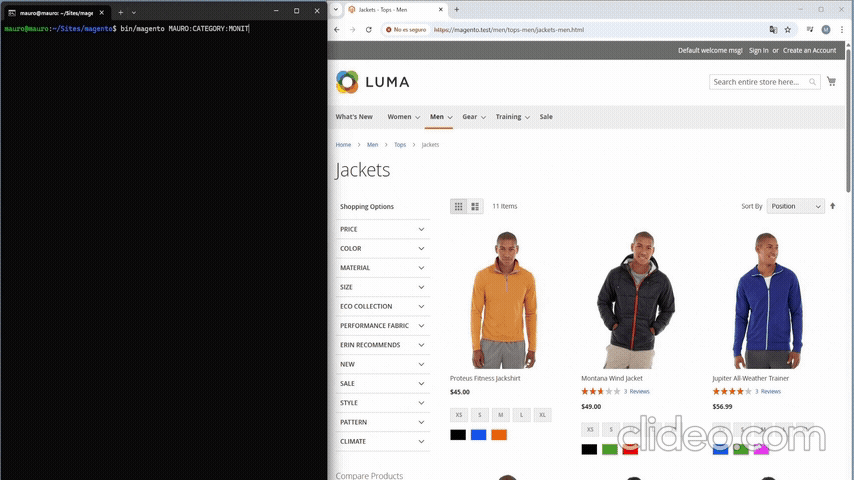
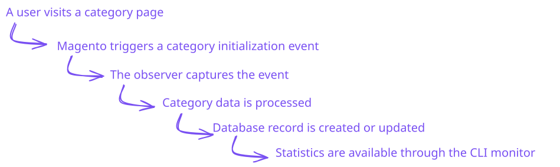
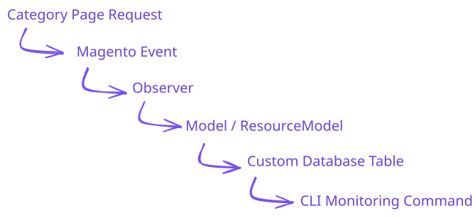
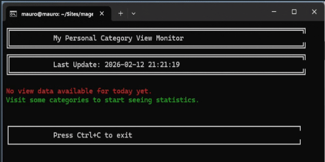
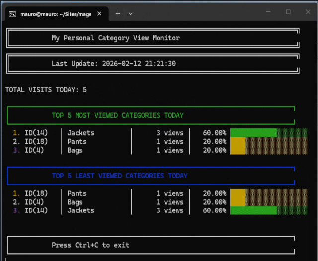
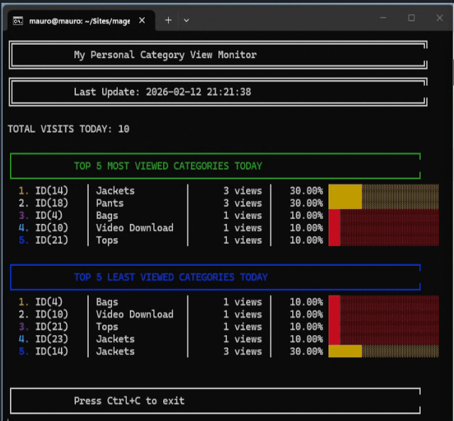
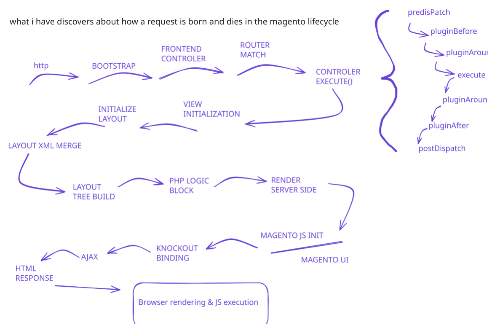

# Category Tracking Module


A lightweight Magento 2 module that monitors and records category page views in real time.  
It helps developers and store administrators understand customer browsing behavior at the category level using Magento’s event-driven architecture.

The goal of this module is not only to provide analytics, but also to demonstrate clean Magento architecture patterns such as observers, resource models, dependency injection, and custom CLI commands.



---

## Table of Contents

- [Overview](#overview)
    - [How It Works](#how-it-works)
    - [Architecture Flow](#architecture-flow)
- [Features](#features)
- [Example CLI Output](#example-cli-output)
- [Magento Concepts](#magento-concepts)
- [Database Schema](#database-schema)
    - [Table: `category_view_tracking`](#table-category_view_tracking)
    - [Schema Behavior](#schema-behavior)
- [Installation](#installation)
    - [Requirements](#requirements)
    - [Installation Steps](#installation-steps)
- [Usage](#usage)
    - [Automatic Tracking](#automatic-tracking)
    - [Monitor Statistics](#you-just-need-to-open-monitor-statistics)
- [Module Structure](#module-structure)
- [Design Decisions](#design-decisions)
    - [Observer-Based Implementation](#observer-based-implementation)
    - [Daily Counters Strategy](#daily-counters-strategy)
- [Uninstall](#uninstall)
- [Author](#author)

---

## Overview

`Mauro_CategoryTracking` listens for category view events and stores them in a custom database table with daily counters.

When a category is visited:

- The event is intercepted
- The category is identified
- A record is created or updated
- Statistics become available immediately via CLI

The module keeps one record per category per day and automatically increments counters when categories are revisited.

### How It Works

The module follows a simple event-driven flow:



### Architecture Flow



---

## Features

- Tracks category page views automatically
- Stores daily visit counts
- Prevents duplicate records using unique constraints
- Updates category statistics in real time
- CLI monitoring dashboard
- Displays most and least viewed categories
- Percentage-based statistics
- Progress bar visualization in terminal
- Lightweight implementation with minimal performance impact
- Clean Magento architecture patterns

---

## Example CLI Output

when we have no recorded data



When we already have data recorded in the database.

example 1



example 2:



---

## Magento Concepts

This module showcases several core Magento concepts:

- Event Observers (`catalog_controller_category_init_after`)
- Model–ResourceModel pattern
- Resource Models and Collections
- Custom database tables using `db_schema.xml`
- Dependency Injection (`di.xml`)
- Custom Magento console commands
- Event-driven architecture
- Unique constraints and database indexes
- Direct database operations using ResourceConnection



---

## Database Schema

### Table: `category_view_tracking`

| Column         | Type      | Description          |
| -------------- | --------- | -------------------- |
| id             | int       | Primary key          |
| category_id    | int       | Magento category ID  |
| category_name  | varchar   | Category name        |
| view_count     | int       | Number of views      |
| date           | date      | Tracking date        |
| last_viewed_at | timestamp | Last visit timestamp |

### Schema Behavior

- One record per category per day
- Unique constraint prevents duplicate entries
- Fast daily analytics queries
- Foreign key linked to Magento categories

---

## Installation

### Requirements


Magento 2.4+

- Composer (2.9.3 o superior)
- OpenSearch (3)
- MariaDB (11.4)
- New Relic (No requerido)
- PHP (8.4 o 8.3)
- RabbitMQ (4.1)
- ActiveMQ Artemis (2)
- Valkey (8)
- nginx (1.28)

You can see more specifications here

https://experienceleague.adobe.com/en/docs/commerce-operations/installation-guide/system-requirements

Recommended development environment (I used this to develop the module):

https://github.com/markshust/docker-magento

---

### Installation Steps

Navigate to your Magento project root and install the module:

```
mkdir -p app/code/Mauro/CategoryTracking
git clone https://github.com/maruccimauro/magento-2-category-tracking-Module.git app/code/Mauro/CategoryTracking
```

Enable the module:

```
php bin/magento module:enable Mauro_CategoryTracking
php bin/magento setup:upgrade
php bin/magento cache:flush
```

---

## Usage

### Automatic Tracking

Once installed and enabled, the module begins tracking category views automatically.  
No configuration is required.

### You just need to open Monitor Statistics

Run the monitoring command:

```
php bin/magento mauro:category:monitor
```

Optional refresh interval:

```
php bin/magento mauro:category:monitor --interval=2
```

Default interval is 1 second.

Press `Ctrl + C` to exit.

---

## Module Structure

```
Mauro/CategoryTracking
├── etc/
│   ├── module.xml
│   ├── db_schema.xml
│   ├── events.xml
│   └── di.xml
├── Observer/
│   └── CategoryViewObserver.php
├── Model/
│   ├── CategoryView.php
│   └── ResourceModel/
│       ├── CategoryView.php
│       └── CategoryView/Collection.php
├── Console/
│   └── Command/MonitorViews.php
└── registration.php
```

---

## Design Decisions

### Observer-Based Implementation

Using an observer keeps the module decoupled from controller logic and aligns with Magento’s event-driven architecture.  
This makes the module easier to extend and safer to maintain.

### Daily Counters Strategy

- Simplifies analytics queries
- Peak interest levels
- Impact of immediate campaigns
- Generate promotions

---

## Uninstall

To remove the module:

```
php bin/magento module:disable Mauro_CategoryTracking
rm -rf app/code/Mauro/CategoryTracking
php bin/magento setup:upgrade
```

---

## Author

Mauro Marucci
